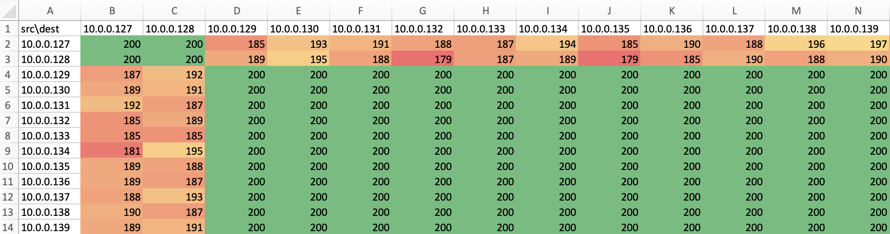

# dping

util to perform distributed ping among server nodes to identify network degradation, using ansible and python

## Usage

Run `./dping <inventory.ini>` and it will generate a csv file under current working directory containing the ping result, which can be further analysed in Excel or other toolings.

## Example:

```
$ ./dping.sh prod.ini
open ICMP firewall and install/update iputils
...
...
run distributed ping, takes a few minutes...
...
...
gather ping summary
remove ICMP firewall rule
...
...
finished: prodPingSummary.csv

$ cat prodPingSummary.csv
src\dest,10.0.0.1,10.0.0.2
10.0.0.1,200,198
10.0.0.2,195,200
```

Sample Result in Excel (after coloring cells):

